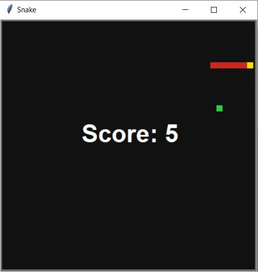

# Snake Game

- The classic snake game using the 'turtle' and 'freegames' modules

- Use the arrow keys to move the head of the snake

- Features such as final score and preventing illegal moves added

## Requirements

- Use this command to install the 'freegames' module
`$ python3 -m pip install freegames`

- The 'freegames' module reference can be found [here](https://pypi.org/project/freegames/)

## Working

